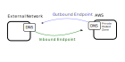

# AWS Route 53

## **1. Introduction**

AWS Route 53 is a fully managed, highly available, and scalable Domain Name System (DNS) service.

## **2. DNS Fundamentals**

This section provides some fundamental information.

Recommendation: Be sure to understand DNS fundamentals before learning about AWS Route53.

### **2.1 Recap of DNS Concepts: Zones, Records, and Nameservers**

- **Domain Registrar:** A service where you register your domain name. Examples: *NIC, Amazon Route 53, GoDaddy, Google.

- **DNS Record Types:** Entries that map domain names to IP addresses or other domain names. Most common record types include:

    - **A Records:** Map a domain name to an IPv4 address.
    - **AAAA Records:** Map a domain name to an IPv6 address.
    - **CNAME Records:** Alias one domain name to another.
    - **NS Records:** Specify the authoritative name servers for a domain.
    - **MX Records:** Define mail exchange servers for email delivery.

- **Zone File:** A file containing all the DNS records for a particular domain or zone. This file is maintained by the authoritative DNS servers.

- **Nameservers:** Servers that host the zone file and respond to DNS queries. When you register a domain, the registrar provides nameservers that will eventually resolve the DNS queries for that domain.

- **Fully Qualified Domain Name (FQDN):** A complete domain name that specifies its exact location within the DNS hierarchy. For example, _api.[www.example.com](http://www.example.com/)._ (with a trailing dot indicating the root).

## **3. Introduction to Route 53**

:::note[Etymology]
The service name *Route 53* itself is a nod to the well-known port 53 used by DNS. *Route* emphasizes its routing capabilities beyond basic name resolution.
:::

### **3.1 Core Features**

- **Domain Registration:**
  - You can purchages and register domains.
  - After a domain is registered, you automatically get a hosted zone to manage its DNS records.
- **DNS Record Management:** You can manage your records
  - You can use standard DNS record types (ex: *A*, *AAAA*, *CNAME*)
  - You can use AWS-specific types (*Alias*)
- **Routing Policies:**
  - Simple routing
  - Weighted routing
  - Latency-based routing
  - Failover routing
  - Geolocation routing
  - Geoproximity routing ( = Geolocation + radius )
  - IP-based routing
  - Multi-value answer routing
- **Health Checks and Automated Failover:**
  - Integrated health-check mechanisms
  - Automatic failover to healthy resources
- **Scalability and SLA:**
  - High availability (100% availability SLA)
  - Global service
  - Managed service
- **Main Payment**:
  - Pay per domain
  - Pay per DNS query

## **4. Record Attributes**

### **4.1 Attribute *Time-to-Live (TTL)***

TTL = How long a DNS response is cached

 
Considerations:

- **Cost:** Longer TTL can help reducing cost. Reason: AWS charges for DNS queries. Longer TTL means fewer DNS queries.
- **Caching Behavior:** Once a DNS resolver caches a record, it will serve that record until the TTL expires. Even if you update the record in Route 53, the cached copy might persist.
- **Strategy for Record Changes:** For resources that may change frequently (for example, during a upgrade or testing), temporarily lowering the TTL can help ensure a smooth transition.

Suggesions:

- Production Systems:
  - Set moderate TTL. Lower TTL for planned updates or migrations.

### **4.2 Record Types: CNAME vs. Alias (AWS-Specific Optimization)**

- **CNAME Records:** A canonical name (CNAME) record maps one domain name to another. For example, you can alias _app.example.com_ to _myapp.loadbalancer.amazonaws.com_.
- **Alias Records:** Alias records are Route 53–specific and allow you to map a domain name to AWS resources (ex.:  Application Load Balancer, CloudFront distribution, S3 website endpoint).

Comparison:

|                                          | CNAME  | Alias     |
|------------------------------------------|--------|-----------|
| Usable for subdomains                    | Yes    | Yes       |
| Usable for zone apex (root of DNS zone)  | No     | **Yes**       |
| Cost                                     | Billed separately| **Free** |
| Automatically reflect changes in the underlying AWS resource  | No  | Yes |
| TTL management                            | Manual  | Automatic |

## **5. Routing Policies for Traffic Management**

Routing policies define the criteria used to determine how traffic is routed.

### **5.1 Simple Routing Policy**

Properties:

- **Simple routing**: Routes Single DNS record to single or multiple resources
- **No health checks**: monitoring enabled

Use cases:

- Mapping of a domain name to a single resource.
- No Failover needed (becaues health checks are not available).

### **5.2 Weighted Routing Policy**

Distribute traffic among multiple resources based on assigned weights.

:::note[Weights are relative]
Weights do not have to sum to 100. The traffic percentage is calculated by dividing each record’s weight by the total weight.
:::

Properties:
- Only route to healthy targets (if health checks are enabled)

Use Cases:
- A/B Testing
- Gradual Rollout
- Load Balancing accross multiple regions

### **5.3 Latency-Based Routing Policy**

Directs users to the AWS endpoint that provides the lowest latency.

Lowest Latency is determined by measuring the network latency between the user’s location and the available AWS regions.

Properties:

- Only route to healthy targets (if health checks are enabled)

Use Cases:
- Improved performance and user experience.

Considerations:
- **User Location:** Latency-based routing is highly dependent on the geographic location of the user.

### **5.4 Failover Routing Policy (Active-Passive)**

You designate one endpoint as *primary* and another as *secondary*. When the *primary* endpoint becomes unhealty, traffic is routed to the *secondary* endpoint. When *primary* becames healthy again, traffic is automatically restored to *primary*.

Considerations:

- **Health Check Dependency:** The primary record must be associated with a health check to ensure accurate failover.
- **Automatic Recovery:** Once the primary endpoint recovers, traffic will revert according to your configured TTL and health check intervals.

### **5.5 Geolocation Routing Policy**

Route traffic based on the geographic location of your users. You can specify regions, countries, states.

Considerations:

- **Default Routing:** You should create a default record to handle unmatched locations. Reason: Because not all user locations may match a specific geolocation record.

Use Cases:
- Localization
- Regulatory compliance

### **5.6 Geoproximity Routing Policy (Traffic Flow)**

Route traffic by geographic distance and a configurable bias value.
Flow control is done using Route 53's *Traffic Flow graphical editor*.

Properties:
- **Bias control:**
  - Positive bias increases an endpoint's traffic share.
  - Negative bias decreases an endpoint's traffic share.

Use cases:
- Shift traffic between nearby regions.
- Balance regional capacity without changing client records.

### **5.7 IP-Based Routing Policy**

Route traffic based on client IP ranges (CIDR blocks).
Define CIDR collections and map them to endpoints.

Properties:
- .

Use cases:
- ISP or network-specific routing.
- Region or tenant-specific traffic control.

### **5.8 Multi-Value Answer Routing Policy**

Return multiple healthy records in one DNS response.

Properties:
- Returns up to 8 healthy records per response.
- Supports health checks.

Compared to simple routing:
- Filters unhealthy endpoints.
- Enables basic client-side load distribution.

## **6. Health Checks**

Health checks monitor endpoint availability and optionally content.

Supported Protocols:
- HTTP
- HTTPS
- TCP

Configuration:
- Checking Interval (typically 10s or 30s).
- Failure threshold: consecutive failed checks before unhealthy.
- Recovery threshold: consecutive successful checks before healthy.
- Optional string match for HTTP/HTTPS response content (you can specify a string that must appear in the first 5,120 bytes of the response.)

### **6.2 Health Checks with Routing Policies**

Health checks can be attached to routing records.

Behavior:
- Failover routing: switch from primary to secondary when primary is unhealthy.
- Weighted routing: exclude unhealthy endpoints from answer selection.
- Multi-value routing: exclude unhealthy endpoints from answer selection.

## **7. Domain and Hosted Zone Management**

- **Third-Party Registered Domains:** You can easily use Domains, registered at a different registrar.

- **Migrate Third-Party Registered Domains to Route 53:** How to Implement (Recommended sequence):
  1. Export current DNS records from existing provider.
  2. Create hosted zone in Route 53.
  3. Recreate/import records.
  4. Lower TTL before cutover (take into account, that a certain TTL provides a safety net in case of you Route53 settings were not correct).
  5. Update registrar NS records to Route 53 name servers.
  6. Validate resolution and monitor query logs.

- **Subdomain Delegation:** Delegate a subdomain to another hosted zone or account.  How to Implement:
  1. Create hosted zone for subdomain (example: _acme.example.com_).
  2. In parent zone, create NS record for that subdomain.
  3. Point NS record to subdomain hosted zone name servers.

## **8. DNS Security Features**

### **8.1 DNSSEC**

Route53 supports DNSSEC (not AWS-specific feature of DNS)

**Short Recap on DNSSEC**

DNSSEC (DNS Security Extensions) adds signature and signature validation for DNS records.

Goal:
- Protect against DNS spoofing and cache poisoning.

Key parts:
- KSK (Key Signing Key) (managed by customer, stored in AWS KMS)
- ZSK (Zone Signing Key) (managed by Route53)
- DS (Delegation Signer) record in parent zone for chain of trust

How to Implement:
1. Enable DNSSEC signing for the hosted zone.
2. Create/manage KSK (via KMS).
3. Publish DS record in parent zone.
4. Monitor DNSSEC-related metrics.

### **8.2 Route 53 DNS Firewall **

DNS Firewall filters outbound DNS queries from VPCs.

Use cases:
- Prevent your components to access certain (possibly malisious) domain.
- Control what kind of domains your build pipeline is allowed to query
- preventing attackers from sending data out of your system via DNS queries.

Capabilities:
- Allow/block lists by domain.
- Rule groups for centralized policy.
- Fail-open (queries are allowed if the firewall fails) or fail-close (queries are blocked if the firewall is unavailable) behavior.

Considerations:
- **Scope**: Settings apply globally or per VPC
- **Price**:
    - Pay per query
    - You can achieve a similar effect (prevent access to certain domain) using Route53 DNS private hosted zone, which is free for queries.

## **9. Monitoring and Logging**

Queries can be logged out to various services and from there be analysed for annomalies.

- **Log Destination:**
  - CloudWatch
  - S3
  - Kinesis Data Firehose
- **Log format:**  timestamp, hosted zone ID, query name, query type, response code, protocol detail, and the client’s EDNS subnet

Capabilities:

- **Log DNS Queries to Public Hosted Zone:** Log queries to public hosted zone

- **Log Outgoing DNS Queries:** Log queries originating from VPC (using Route 53 Resolver)

- **AWS RAM Integration:** Use shared configurations in multi-account environments (for example with AWS RAM).

Use Cases:
  - Auditing
  - Detect annomalies
  - Regulatory compliance
  - Trouble shooting
  - Performance optimization

## **10. Hybrid DNS with Route 53 Resolver**

### **10.1 Resolver Endpoints**

*Route 53 Resolver Endpoints* resolve DNS queries between VPC and on-premis DNS.

Endpoint types:
- **Inbound endpoint** An external DNS resolver (DNS server) queries a private hosted zone name on AWS.
- **Outbound endpoint**: Route53's DNS resolver queries an external DNS server to resolve queries from AWS VPC resources.

### **10.2 Hybrid DNS Design Considerations**

Design checklist:
- Deploy endpoints across multiple AZs.
- Use conditional forwarding rules for specific domains that should be resolve outside the network.
- Restrict access with security groups and network ACLs.
- Share rules/endpoints across accounts when needed.
- Scale endpoint IPs for higher query throughput.

## **11. Common Reference Architectures**

### **11.2 Architecture Patterns**

#### **Enterprise Multi-Region Architecture**

- **Goal**: Support global applications that require high performance and resilience.

Key configurations:
- Multi-region architecture
- Traffic is distributed across various AWS regions using
  - latency-based routing and
  - weighted routing.
- Health checks monitor each endpoint
- Failover configurations are in place to automatically redirect traffic in the event of an outage.

Key components:

- **Global Load Balancing:** Combine latency-based routing with weighted policies to optimize traffic flow.
- **Health Monitoring:** Integrate health checks with failover routing to ensure high availability.
- **Real-Time Logs:** Use CloudWatch for real-time monitoring and query-logging to maintain operational visibility.

#### **Hybrid DNS (On-Premises + AWS)**

- **Goal**: Maintain legacy systems on-premises && use cloud services

Key configuration
- Hybrid DNS architecture using inbound resolver endpoints and outbound resolver endpoints  
  Reason: integrates on-premises data centers with AWS resources.
- Use *conditional forwarding rules*.  
  Reason: Direct specific DNS queries to the appropriate resolver (based on domain name)

#### **Multi-Account DNS Management**

Components:
- Subdomain delegation by team/account.
  - Note: Be careful using subdomains for develop or staging environments if production own the domain.  
  Reason: You'll need to touch production to setup development.
- Shared resolver rules and endpoints.
  - Implementation: Use AWS RAM to sahre resolver rules and endpoints among accounts.
- Standardized routing and security controls accross the organization.

#### **Security-Focused DNS**

Components:
- DNSSEC.  
  Reason: for signed responses.
- DNS Firewall domain filtering.  
  Reason: Prevent data exfiltration.
- Centralized DNS logging and alerting.  
  Reason: Detect annormalies and security incidents.
